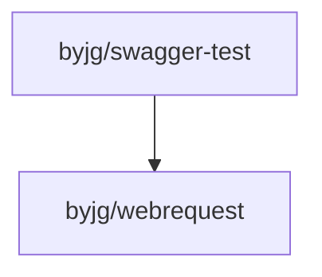

# Swagger Test

[](https://github.com/sponsors/byjg)
[](https://github.com/byjg/php-swagger-test/actions/workflows/phpunit.yml)
[](http://opensource.byjg.com)
[](https://github.com/byjg/php-swagger-test/)
[](https://opensource.byjg.com/opensource/licensing.html)
[](https://github.com/byjg/php-swagger-test/releases/)

A set of tools for testing your REST calls based on the OpenApi specification using PHPUnit.
Currently, this library supports the OpenApi specifications `2.0` (formerly swagger), `3.0.x`, and **`3.1.x`**.

## OpenAPI Version Support

- **Swagger 2.0** - Full support
- **OpenAPI 3.0.x** - Full support (3.0.0, 3.0.1, 3.0.2, 3.0.3)
- **OpenAPI 3.1.x** - Full support with JSON Schema 2020-12 features ✨

### OpenAPI 3.1 Features

OpenAPI 3.1 brings full JSON Schema 2020-12 compatibility. Key features supported:

- **Nullable Types**: Use JSON Schema union types `["string", "null"]` instead of the deprecated `nullable` keyword
- **Webhooks**: Describe and validate incoming HTTP requests your API will receive
- **`const` Keyword**: Validate constant values
- **Conditional Schemas**: Use `if/then/else` for conditional validation
- **Tuple Validation**: Validate arrays with specific types at specific positions using `prefixItems`
- **`$ref` with Sibling Keywords**: References can have additional properties alongside them

For detailed documentation on OpenAPI 3.1 features, see [OpenAPI 3.1 Features Guide](docs/openapi-3.1-features.md).

### Limitations

Some features of the OpenAPI specification are not fully implemented:

- Callbacks (OpenAPI 3.0/3.1)
- Links (OpenAPI 3.0/3.1)
- References to external documents/objects
- Some advanced JSON Schema 2020-12 keywords (e.g., `unevaluatedProperties`, `dependentSchemas`)

For details on the schema classes and their specific features, see [Schema Classes](docs/schema-classes.md).

PHP Swagger Test can help you to test your REST API. You can use this tool both for Unit Tests or Functional Tests.

This tool reads an OpenAPI/Swagger specification in JSON format (not YAML) and enables you to test the request and
response.
You can use the tool "[https://github.com/zircote/swagger-php](https://github.com/zircote/swagger-php)" for creating the JSON file when you are developing your
REST API.

The ApiTestCase's assertion process is based on throwing exceptions if some validation or test failed.

## Documentation

- [Functional test cases](docs/functional-tests.md) - Testing your API with HTTP requests
- [Contract test cases](docs/contract-tests.md) - Testing without HTTP using custom requesters
- [Runtime parameters validator](docs/runtime-parameters-validator.md) - Validating requests in production
- [Mocking Requests](docs/mock-requests.md) - Testing with mocked responses
- [Schema classes](docs/schema-classes.md) - Working with OpenAPI 2.0, 3.0, and 3.1 schemas
- [OpenAPI 3.1 features](docs/openapi-3.1-features.md) - Webhooks, const, if/then/else, tuple validation, and more
- [Using the OpenApiValidation trait](docs/trait-usage.md) - Flexible validation without extending ApiTestCase
- [Advanced usage](docs/advanced-usage.md) - File uploads, custom clients, authentication, and more
- [Exception handling](docs/exceptions.md) - Understanding and handling validation exceptions
- [Migration guide](docs/migration-guide.md) - Upgrading from older versions
- [Troubleshooting](docs/troubleshooting.md) - Common issues and solutions
- [Version comparison](docs/version-comparison.md) - Feature support matrix across OpenAPI versions

## Who is using this library?

- [ByJG PHP Rest Reference Architecture](https://github.com/byjg/php-rest-reference-architecture)
- [Laravel Swagger Test](https://github.com/pionl/laravel-swagger-test)

## Install

```bash
composer require "byjg/swagger-test"
```

## Tests

```bash
SPEC=swagger php -S 127.0.0.1:8080 tests/rest/app.php &
SPEC=openapi php -S 127.0.0.1:8081 tests/rest/app.php &
vendor/bin/phpunit
```

## References

This project uses the [byjg/webrequest](https://github.com/byjg/webrequest) component.
It implements the PSR-7 specification, and a HttpClient / MockClient to do the requests.
Check it out to get more information.

## Questions?

Please raise your issue on [Github issue](https://github.com/byjg/php-swagger-test/issues).

## Dependencies



----
[Open source ByJG](http://opensource.byjg.com)
